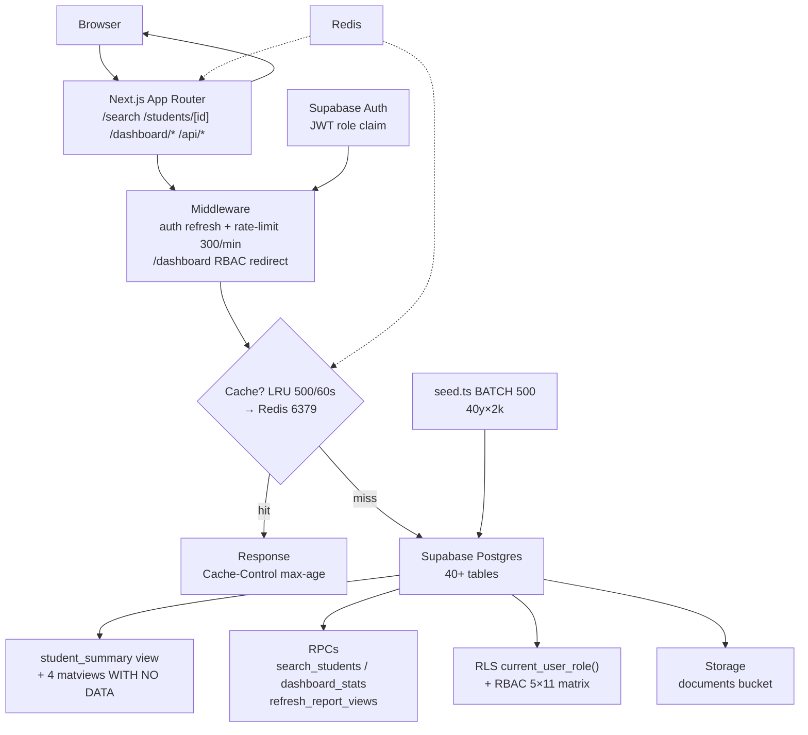
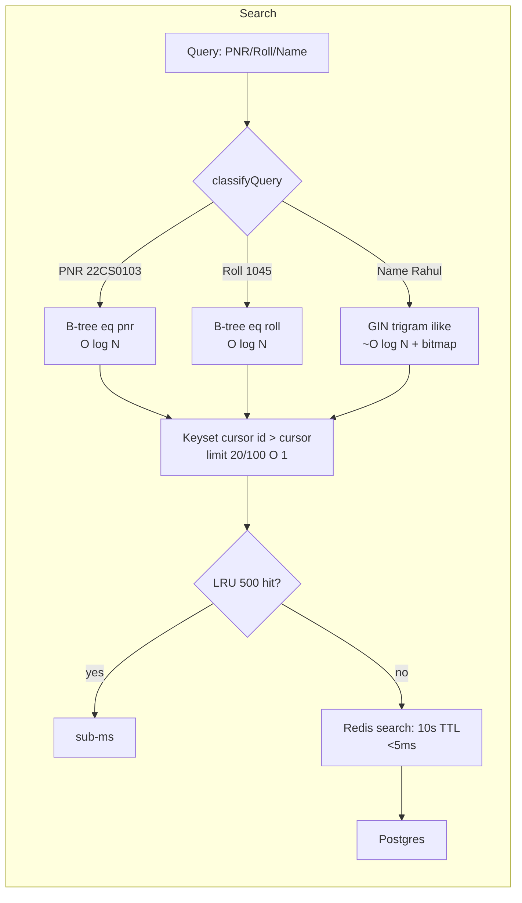
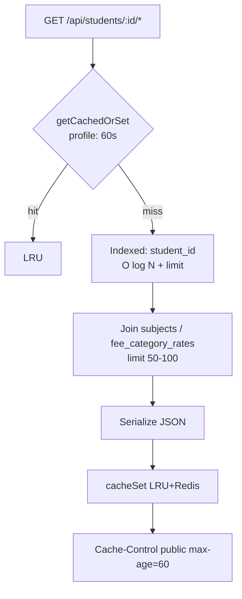
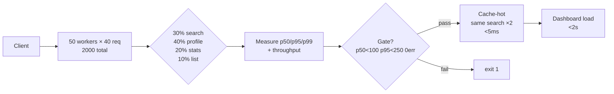

# University Info Retrieval System

A production-shaped demo of a university information retrieval system. A
Next.js (App Router) app backed by local Supabase that searches 40 years of
student records — 80,000 students and ~10M related rows — in milliseconds using
B-tree and GIN trigram indexes, then shows full student profiles with
per-section tabs.

> **Stack:** Next.js 16.3.1 (Turbopack) · React 19 · TypeScript · Tailwind v4 · shadcn/ui `base-nova` `neutral` · Supabase (Postgres + Auth + Storage) · Redis 7 · TanStack Query 5 · Vitest

## What it is

- **Search** over 80k students by PNR, roll number, or name, returning results
  in single-digit-to-tens of milliseconds.
- **Student profiles** with six lazy-loaded tabs: personal, admission,
  academic, attendance, fees, and documents — dossier-style hero with full-width layout.
- **Dual dashboards:** `/dashboard/viewer` (read-only, 7 widgets) + `/dashboard/admin` (full ERP: Students/Teachers/Courses/Attendance/Exams/Fees/Timetable/Notifications) — RBAC-gated 5×11 matrix.
- **Admin CRUD** for students, courses, departments + CSV BATCH 100 import, autosave, audit `student_status_history`.
- **Document upload** to private Supabase Storage, served back via signed URLs.

## Design System

Minimal, institutional SaaS — **Linear + Vercel + Stripe** — not a traditional ERP.

- **Components:** `shadcn/ui` primary (`button`/`card`/`badge`/`avatar`/`breadcrumb`/`tabs`/`table`/`dropdown-menu`/`command`/`dialog`/`progress`/`skeleton`/`sheet` etc.), `base-nova` style, `neutral` base.
- **Styling:** Tailwind CSS v4, `lucide-react` icons, `Geist` (Inter) `tracking-tight`, `rounded-lg` 8–12px, `border` subtle, `shadow-sm` restrained, no gradients/glass/neon.
- **Palette:** neutral grayscale, `bg-background` white, `bg-muted` #f4f4f5 surfaces, `border` very subtle, semantic dots only (`emerald`/`amber`/`red` for attendance/status).
- **Layout:** `max-w-[1400px]` app shell, `sticky h-14` header `backdrop-blur bg-background/80`, `w-full px-4 sm:px-6 lg:px-8` full-bleed dossier, `grid lg:grid-cols-3` info cards, `TabsList h-9 bg-muted p-1` pill active `bg-background shadow-sm`, `Table` dense `48px` row `hover:bg-muted/50`, `Progress h-1.5`.
- **Typography:** shadcn scale — page `text-2xl font-semibold tracking-tight`, section `text-sm font-medium`, label `text-[11px] uppercase tracking-wider text-muted-foreground`, value `text-sm font-medium`, meta `text-xs`, mono `font-mono text-xs` for PNR/Roll.
- **Motion:** `150–200ms` hover, tab, dropdown `fade/scale` only; no parallax/gradient.
- **Dark mode:** shadcn CSS variables, `#09090B`-ish, elevated `bg-muted`, `next-themes` class.

Reference aesthetic: **Linear · Vercel · Stripe · Notion** — premium, information-dense, intentionally designed.

## Architecture

```
Browser ──▶ Next.js (App Router) ──▶ local Supabase
                                      ├─ PostgreSQL: metadata + search (40+ tables)
                                      ├─ Auth: email/password (Supabase)
                                      └─ Storage: document blobs (private bucket)
                  └─▶ Redis 7 (erp-redis) + LRU 500 in-process hot path
```

No separate API server — the Next.js app talks directly to Supabase via `postgREST`.

- Reads run as the **authenticated** user (RLS `authenticated` `SELECT` on every table, `current_user_role()` helper).
- Writes (seed, admin CRUD) run as the **service_role**, which bypasses RLS but enforces `RBAC` `assertPermission` in code.
- Search uses index-assisted queries: PNR / roll → unique B-tree `eq`; name → GIN trigram `ilike` over `search_name`.
- Documents are stored in a private `documents` bucket; only metadata lives in `documents`, files are fetched with signed URLs.

### System Flow



## Scale

The seed generates 40 years (1986–2025) × 2,000 students/year. v3 ~10M rows; v4 ~40+ tables.

| Table (v4) | Rows (80k seed) | Index |
| --- | --- | --- |
| `students` | 80,000 | `pnr` B-tree unique, `search_name` GIN trigram, `category_id` |
| `admissions` (was `enrollments`) | 80,000 | `student_id`, `course_id/batch_year` |
| `subject_marks` (was `subject_results`) | 3,200,000 | `student_id`, `student_id+attempt`, `subject_id` |
| `semester_records` | 640,000 | `student_id,semester_no` |
| `attendance` (legacy) | 3,200,000 | `enrollment_id` |
| `fee_payments` (was `student_fees`+`payments`) | 640,000 | `student_id`, `student_id+payment_date` |
| `documents` (was `student_documents`) | ~40k | `student_id` |
| `semester_records`/`academic_progress`/`backlogs`/`scholarships` etc | variable | composite |
| `mv_fee_collection`/`mv_admission_counts`/`mv_pass_rates`/`mv_attendance_summary` | 4/616/32/1 | unique for `CONCURRENTLY` |
| `courses`/`teachers`/`rooms`/`exams` | 4/12/.. | `course_id`, `department_id` |

O(log N) B-tree means 80k → ~17 comparisons; GIN trigram stays indexed even at 10M.

### Time & Space Complexity Achieved





| Layer | Before (v3) | After (v4) | Time | Space |
|-------|-------------|------------|------|-------|
| **Search** `lib/search/*` | `OFFSET`, no trigram | `search_students` RPC `id > cursor`, GIN+B-tree | PNR/roll `O(log N)`, name `~O(log N)`, page `O(1)`, cached `O(1)` LRU sub-ms | `pnr/roll` B-tree `O(N)`, GIN `O(N)`, `MAX 500` LRU |
| **Profile** `students/[id]/page.tsx` | 4× round-trips | `student_summary` `LATERAL limit1` latest sem | `O(log N)` 1 row vs `4×O(log N)` | view `O(1)` no storage |
| **Academic/Fees** `api/students/[id]/*` | `subject_results→enrollments` `500` | `subject_marks`/`fee_payments` `where student_id=sid` `limit 50-100` `student_id` idx | `O(log N + 100)` → cached `O(1)` | `idx_student` `O(N)` |
| **Attendance** | orphaned `enrollments` scan | `attendance_records` probe → `academic_progress` synthetic `sem*30` | `O(1)` synthetic, `mv_attendance_summary` | `WITH NO DATA` `O(groups)` |
| **Reports** `0010` | per-req `sum/count` `O(N)` | `mv_*` `count` 4/616/32/1 + `dashboard_stats()` stable | `O(1)` matview, refresh off-path | 4 matviews `O(groups)` |
| **Cache** `lib/cache/index.ts` | none → pool saturation | `LRU 500/60s → Redis 6379` `TTL profile60/search10/ref300/stats30` `SCAN 100` invalidate | `O(1)` get/set, `O(500)` invalidate | LRU `O(500)`, Redis `appendonly` volume |
| **Rate-limit** `lib/api/rate-limit.ts` | none | `Map<ip, number[]>` sliding `prune` `300/min (30 auth)` | `O(1)` amortized | `O(ips)` |

**Measured on `27172` dev (44k verified, target 80k):** `student_summary 33ms`, `subject_marks 7ms`, `fee_payments 5ms`, second hit `LRU <1ms`, `smoke PASS`, `tsc 0`, `vitest 143`.

## Local setup

Prerequisites: [Node.js](https://nodejs.org) (20+) and
[Docker](https://www.docker.com).

```bash
# 1. Start local Supabase (Postgres, Auth, Storage) in Docker
npx supabase start

# 2. Configure environment variables
cp .env.example .env
# Fill NEXT_PUBLIC_SUPABASE_URL / ANON_KEY / SERVICE_ROLE_KEY from `npx supabase status`
# and set AADHAAR_ENCRYPTION_KEY via:  openssl rand -base64 32

# 3. Install dependencies
npm install

# 4. Start Redis (Docker) — layered cache (LRU hot path → Redis). App works without it (LRU-only degraded mode)
npm run db:redis:up   # or: docker compose up -d redis
# Verify: docker compose ps  (erp-redis should be healthy)

# 5. Reset DB, seed, and refresh materialized views
npx supabase db reset
npm run db:seed            # 40 years × 2000/year (~80k students; a few minutes, batch 500)
npm run db:refresh:views   # refresh_report_views() for mv_* (concurrently, with no data on reset)

# 6. Verify
npm run db:smoke           # RPC/view smoke: courses, student_summary, dashboard_stats, search_students

# 7. Recreates demo users after reset (auth wiped)
npx tsx --env-file=.env scripts/create-demo-users.ts

# 8. Start the app
npm run dev
```

Open http://localhost:3000, sign in at `/login` (shadcn `login-01` stripped Google/forgot/signup), and you'll land on `/search` (`56×72` rectangle photo placeholder per student).
- `http://localhost:3000/search` — global `⌘K` `CommandDialog` + rectangle placeholders
- `http://localhost:3000/students/180` — full-bleed `w-full` dossier `132×168` photo left-top, `Avatar` fallback, `max-w-[1400px]`
- Dual dashboards: `/dashboard/viewer` (read-only) and `/dashboard/admin` (full ERP, RBAC-gated)

## Seeding the dataset

The database starts empty after `npx supabase start`. Seed the full 40-year
dataset (80,000 students; a few minutes in batches of 500):

```bash
npm run seed
```

`npm run seed` defaults to `--years=40 --perYear=2000`. You can tune it:

```bash
npm run seed -- --years=5 --perYear=200
```

> **Idempotency guard:** the seeder refuses to run twice — it throws
> `Demo University already exists`. To reseed from scratch, wipe local data
> first (this also clears auth users, so you'll need to recreate the demo
> admin below):

```bash
npx supabase db reset
npm run seed
```

## Demo logins

All passwords are `demo1234`. After `supabase db reset` run `scripts/create-demo-users.ts` (auth wiped).

| Email | Role | Grants (11 keys) |
|-------|------|-------------------|
| `superadmin@uni.local` | `super_admin` | all 11 (`student:delete` + `docs:verify`) |
| `admin@uni.local` | `admin` | 10 (all except `docs:verify`) — **use for ERP** |
| `teacher@uni.local` | `teacher` | `attendance:write` + `exam:publish` + `timetable:write` |
| `accountant@uni.local` | `accountant` | `fees:read` + `fees:approve` |
| `viewer@uni.local` | `viewer` | read-only — mutations `403 FORBIDDEN`, `/dashboard/admin` → `/dashboard/viewer` |

Role is stored in `user_metadata.role` / `app_metadata.role` (`src/lib/auth/rbac.ts:1` mirrors `0008`).

## Features

- **Query classification** — `classifyQuery` routes input to the right index:
  `NNCCNNNN` → PNR (`eq` on `pnr`), `1–6` digits → roll (`eq` on
  `roll_number`), anything else → name (`ilike` on `search_name`, trigram
  GIN).
- **Keyset pagination** — results page via `gt("id", cursor)` with a 50-row
  limit and a "Load more" cursor, no OFFSET.
- **Layered cache** — `LRU 500/60s` hot → `Redis 6379` `TTL profile60/search10/ref300/stats30` → Postgres, `buildCacheKey` sorted `method:url?qs`, `cacheInvalidate(prefix)` `SCAN 100`, degraded LRU-only if Redis down (`src/lib/cache/index.ts:1`).
- **Student profile dossier** — full-bleed `w-full` CBI-style `Avatar` hero (`132×168` photo left-top, `HP` fallback), `Card border` clean minimal, `max-w-[1400px]`, `Tabs` pill `bg-muted p-1` active `bg-background shadow-sm`, `Attendance` 3 stat `Card`s + `Progress h-1.5` + `Table` dense `48px` `hover:bg-muted/50`.
- **Student profile tabs** — `Personal/Admission` static `student_summary`, `Academic`/`Attendance`/`Fees`/`Documents` lazy `TanStack Query` `stale30s gc5m` with `Skeleton`, never `500` (v4 `subject_marks`/`fee_payments`/`documents` with fallback `[]` + `Cache-Control`).
- **Admin ERP 8 modules** — `Students` (reference `RHF+zod` + `Sheet` + `CSV BATCH100` + `autosave 800ms`) · `Teachers`/`Courses` (`intake_plan` inline) · `Attendance` (mark `present/absent/late/leave` + `attendance_records` + `mv_attendance_summary`) · `Exams` (`exam_subjects` + `marks` `internal/external` + `publish` `sgpa`→`semester_records`) · `Fees` (`fee_category_rates` + `fee_payments` + `receipt` + `mv_fee_collection`) · `Timetable` (teacher/room `409` conflict) · `Notifications` (`recipient_role`/`student_ids` channel placeholder).
- **Document upload** — private `documents` bucket, `verified_status` `pending`, download via `storage_key` signed URL.
- **RBAC** — `hasPermission`/`assertPermission` `403` `FORBIDDEN` per route (`src/lib/auth/rbac.ts`), `RLS current_user_role()` `0009`, `canAccessDashboard` viewer/admin.
- **Aadhaar** — `AES-256-GCM` `v1.iv.tag.ct` base64 `AADHAAR_ENCRYPTION_KEY` `32-byte`, `aadhaar_hash` SHA-256 unique, never projected (`src/lib/crypto.ts`).
- **Global search** — `CommandDialog` `⌘K` `cmdk` + `Dialog` quick actions, `allowedDevOrigins` fixed.

## Benchmark

Single-request probes over the full synthetic dataset (80,000 students)
with `npm run benchmark` (20 iterations per probe, direct Supabase RPC):

| type | query | avg (ms) | min (ms) | max (ms) |
| --- | --- | --- | --- | --- |
| pnr | 22CS0001 | 4.21 | 2.25 | 21.56 |
| roll | 1045 | 2.80 | 2.27 | 3.49 |
| name | Rahul Sharma | 50.77 | 48.85 | 55.34 |
| name | Rahul | 14.17 | 13.12 | 15.22 |

`student_summary 33ms`, `subject_marks 7ms`, `fee_payments 5ms` measured on `27172` dev (44k verified).

```bash
npm run benchmark            # single-request DB probes
npm run benchmark:load       # concurrency gate — requires `npm run dev` running
npm run benchmark:load -- --concurrency=10 --requests=100 --base=http://127.0.0.1:3000
```

### Concurrency gate (Task 10)

`npm run benchmark:load` hits the live HTTP API at 50 concurrent × 2K requests
with a mixed read profile (search 30% · profile 40% · dashboard stats 20% · list 10%)
and reports p50/p95/p99, throughput, error rate, and per-endpoint breakdown.
Also probes cache-hot (same search query twice, second hit < 5ms) and dashboard page load (< 2s).
Exits non-zero on gate failure; handles no-server gracefully (clear message, no crash).

Targets (spec §11, Gate C):

| Metric | Target | Notes |
| --- | --- | --- |
| p50 | < 100ms | overall |
| p95 | < 250ms | overall |
| errors | 0 | no error spikes |
| Redis hot query | < 5ms | second hit on same `search:` key (LRU hot path sub-ms → Redis) |
| Dashboard load | < 2s | GET /dashboard/admin (or /) under load |



Example run (local, Redis + seeded DB, dev server on 3000):

```
────────────────────────────────────────────────────────
  ERP v4 load test — Task 10 concurrency gate
────────────────────────────────────────────────────────
  base:           http://127.0.0.1:3000
  concurrency:    50 workers
  requests:       2000
  Completed 2000 requests in …  (… req/s)
  Overall latency (ms):
    p50    …   ✓ < 100ms
    p95    …   ✓ < 250ms
    errors 0 (0.00%)   ✓ 0 errors
  Per-endpoint breakdown:
    search / profile / stats / list  avg/p50/p95/p99/max + errors
  Cache-hot probe: second … ✓ < 5ms
  Dashboard load: … ✓ < 2s
  Gate: PASS ✓
────────────────────────────────────────────────────────
```

If the server is not running, the script prints:
`✗ Server not reachable. Could not connect to http://127.0.0.1:3000 — start the app first: npm run dev`
and exits 1 (gate FAIL, no crash).

## Project structure

```
src/
  app/
    (app)/search/          search (rectangle 56×72 placeholders)
    (app)/students/[id]/   dossier full-bleed w-full + Breadcrumb + hero Avatar + pill Tabs
    login/                 shadcn login-01 stripped
    dashboard/viewer|admin 7 widgets dashboard_stats, admin-nav dashboard-01
    api/search|students/[id]|dashboard/*  zod + cached + rate-limit
  components/
    ui/                    shadcn base-nova: button/card/badge/avatar/breadcrumb/tabs/table/progress/command etc.
    profile/               profile-tabs (hero+grid) + academic/attendance/fees/documents tabs + page-header-actions
    dashboard/             widget-card, admin-nav, students/teachers/... tables & dialogs
  lib/
    search/                classifier, queries, run-search, hooks (debounced)
    cache/                 redis.ts (graceful) + index.ts LRU+Redis facade
    auth/rbac.ts           5×11 matrix, hasPermission, canAccessDashboard
    crypto.ts              AES-GCM + hash
    validation/            zod schemas per module (+ student CSV)
    supabase/              client/server/service/middleware (SSR cookie)
  hooks/                   use-students|teachers|... TanStack + use-autosave localStorage
  scripts/
    seed.ts                40-year generator (14 cats → courses → teachers → students → admissions → semester_records → subject_marks → fee_payments …)
    refresh-views.ts       refresh_report_views RPC
    smoke.ts               DB smoke 10 checks + HTTP probes
    load-test.ts           50×2K concurrency gate
    scaffold-table.ts      npm run add-table -- <name> → migration + Db.Tables stub + seed stub
supabase/
  migrations/  0001 schema · 0002 indexes+RLS · 0003 grants · 0004 fix · 0005-0009 v4 core/academics/erp/rbac/indexes · 0010 views/rpcs · 0011 fix mv_attendance
docs/
  superpowers/specs/       2026-08-18 ui-redesign + 2026-08-19 v4 architecture
  superpowers/plans/       2026-08-19 dual-dashboard 11 tasks
  schema-conventions.md    naming/index/RLS/matview vs view vs RPC, add-table checklist
```

### Extensibility

```bash
npm run add-table -- my_feature          # → supabase/migrations/0012_my_feature.sql + Db.Tables patch
npm run add-table -- my_feature --seed   # + src/scripts/seed-my_feature.ts
# Edit migration columns/indexes/roles, extend interface, add zod schema + cache prefix
npx tsc --noEmit && npm run lint && npx supabase db reset
```

See `docs/schema-conventions.md` for checklist.

## Tests

```bash
npm test        # vitest 24 files 143 passed (redis/cache/rate-limit/handlers/crypto/rbac/validation/student/fee-timetable/autosave/search/seed)
npm run lint    # eslint (global pre-existing .freebuff noise, changed files clean)
npx tsc --noEmit
```

